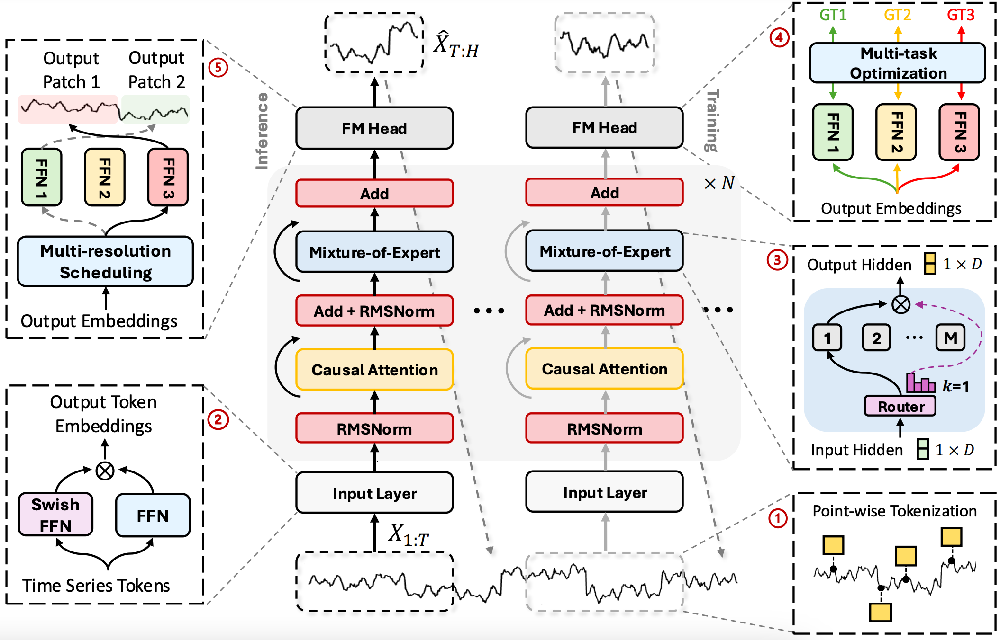

<div align="center">
  <h3><b>Time-MoE: Billion-Scale Time Series Foundation Models with Mixture of Experts </b></h2>
</div>

<div align="center">


</div>

<div align="center">

**[<a href="https://arxiv.org/pdf/2409.16040">Paper Page</a>]**

</div>

<p align="center">


</p>

---
> Time-MoE (Model): **the first work to scale time series foundation models up to 2.4 billion parameters** (trained from scratch)
> 
> Time-300B (Dataset): **the largest open-access time series data collection comprising over 300 billion time points** (spanning more than 9 domains)
---

## Updates/News:

🚩 **News** (Sept 2024): Time-MoE (base) is now available
on [🤗 Hugging Face](https://huggingface.co/Maple728/TimeMoE-50M)!

🚩 **News** (Sept 2024): Time-MoE preprint has been made available on [arXiv](https://arxiv.org/pdf/2409.16040)!

## Introduction

Time-MoE comprises a family of decoder-only time series foundation models with a mixture-of-experts architecture,
designed to operate in an auto-regressive manner, enabling universal forecasting with arbitrary prediction horizons and
context lengths of up to 4096.

<p align="center">
    
</p>


<div align="center">

### Time-MoE Model Card

| Model                                                              | Activated Params. | Total Params. |
|--------------------------------------------------------------------|-------------------|---------------|
| [**Time-MoE (base)**](https://huggingface.co/Maple728/TimeMoE-50M) | 50M               | 113M          |
| **Time-MoE (large)**                                               | 200M              | 453M          |
| **Time-MoE (ultra)**                                               | 1.1B              | 2.4B          |

</div>

## 📚 Training Data

Time-300B dataset will be released soon.

## 🚀 Getting Started

### Installation

1. Install Python 3.10+, and then install the dependencies:

```shell
pip install -r requirements.txt
```
**Time-MoE requires `transformers==4.40.1` .**

2. [Optional] Install flash-attn. (For faster training and inference)

```shell
pip install flash-attn==2.6.3
```

### Making Forecasts

```python
import torch
from transformers import AutoModelForCausalLM

context_length = 12
seqs = torch.randn(2, context_length)  # tensor shape is [batch_size, context_length]

model = AutoModelForCausalLM.from_pretrained(
    'Maple728/TimeMoE-50M',
    device_map="cpu",  # use "cpu" for CPU inference, and "cuda" for GPU inference.
    trust_remote_code=True,
)

# normalize seqs
mean, std = seqs.mean(dim=-1, keepdim=True), seqs.std(dim=-1, keepdim=True)
normed_seqs = (seqs - mean) / std

# forecast
prediction_length = 6
output = model.generate(normed_seqs, max_new_tokens=prediction_length)  # shape is [batch_size, 12 + 6]
normed_predictions = output[:, -prediction_length:]  # shape is [batch_size, 6]

# inverse normalize
predictions = normed_predictions * std + mean
```

+ If the sequences are normalized already:

```python
import torch
from transformers import AutoModelForCausalLM

context_length = 12
normed_seqs = torch.randn(2, context_length)  # tensor shape is [batch_size, context_length]

model = AutoModelForCausalLM.from_pretrained(
    'Maple728/TimeMoE-50M',
    device_map="cpu",  # use "cpu" for CPU inference, and "cuda" for GPU inference.
    trust_remote_code=True,
)

# forecast
prediction_length = 6
output = model.generate(normed_seqs, max_new_tokens=prediction_length)  # shape is [batch_size, 12 + 6]
normed_predictions = output[:, -prediction_length:]  # shape is [batch_size, 6]
```

### Evaluation

+ Prepare the benchmark datasets.

You can access the well pre-processed datasets
from [[Google Drive]](https://drive.google.com/file/d/1NF7VEefXCmXuWNbnNe858WvQAkJ_7wuP/view?usp=sharing), then place
the downloaded contents under `./dataset`.

+ [Example] Running the follow command to evaluate on ETTh1.

```shell
python run_eval.py -d dataset/ETT-small/ETTh1.csv -p 96
```

## Citation

> 🙋 Please let us know if you find out a mistake or have any suggestions!

> 🌟 If you find the Time-MoE models helpful in your research, please consider to star this repository and cite the
corresponding [paper](https://arxiv.org/pdf/2409.16040):

```
@misc{shi2024timemoe,
      title={Time-MoE: Billion-Scale Time Series Foundation Models with Mixture of Experts}, 
      author={Xiaoming Shi and Shiyu Wang and Yuqi Nie and Dianqi Li and Zhou Ye and Qingsong Wen and Ming Jin},
      year={2024},
      eprint={2409.16040},
      archivePrefix={arXiv},
      url={https://arxiv.org/abs/2409.16040}, 
}
```

## Related Resources

* Foundation Models for Time Series Analysis: A Tutorial and Survey, in *KDD* 2024. [\[paper\]](https://arxiv.org/abs/2403.14735) [\[Tutorial\]](https://wenhaomin.github.io/FM4TS.github.io/)
* What Can Large Language Models Tell Us about Time Series Analysis, in *ICML* 2024. [\[paper\]](https://arxiv.org/abs/2402.02713)
* Self-Supervised Learning for Time Series Analysis: Taxonomy, Progress, and Prospects, in *TPAMI* 2024. [\[paper\]](https://arxiv.org/abs/2306.10125) [\[Website\]](https://github.com/qingsongedu/Awesome-SSL4TS)
* A Survey on Graph Neural Networks for Time Series: Forecasting, Classification, Imputation, and Anomaly Detection, in *TPAMI* 2024. [\[paper\]](https://arxiv.org/abs/2307.03759) [\[Website\]](https://github.com/KimMeen/Awesome-GNN4TS)
* Transformers in Time Series: A Survey, in *IJCAI* 2023. [\[paper\]](https://arxiv.org/abs/2202.07125) [\[GitHub Repo\]](https://github.com/qingsongedu/time-series-transformers-review)

## Acknowledgement

We appreciate the following GitHub repos a lot for their valuable code and efforts.

- Time-LLM [\[repo\]](https://github.com/KimMeen/Time-LLM)
- TimeMixer [\[repo\]](https://github.com/kwuking/TimeMixer)
- Time-Series-Library [\[repo\]](https://github.com/thuml/Time-Series-Library)
- Large (Language) Models and Foundation Models (LLM, LM, FM) for Time Series and Spatio-Temporal Data [\[repo\]](https://github.com/qingsongedu/Awesome-TimeSeries-SpatioTemporal-LM-LLM)

## License

This project is licensed under the Apache-2.0 License.
